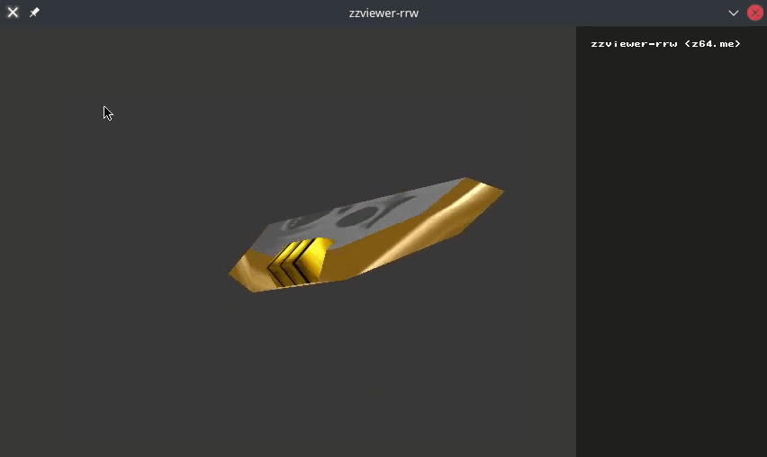

# zzviewer-rrw



`zzviewer-rrw` (re-rewritten) was the third and final iteration of `zzviewer`: a Nintendo 64 model viewer for Zelda games. Unlike its predecessors, this one primarily used software rasterization to display geometry, but was intended to eventually have OpenGL bindings.

It has since been succeeded by [z64viewer](https://github.com/z64me/z64viewer).

## Features
 - Emulates the Nintendo 64's two-cycle rendering
 - Provides an interactive tree view detailing how game maps are constructed
 - Automatically reloads files when changes are detected
 - Billboard effects
 - Texture blending
 - Shiny surfaces

## Usage

```
A few command line examples you can learn from (you must acquire the named files yourself):

   Mirror Shield
      zzviewer-rrw -z "object_link_majora.zobj" 0x16480

   Master Sword
      zzviewer-rrw -r0x04 "gameplay_keep.zobj" -z "object_link_boy.zobj" 0x21F78

   Deku Tree
      zzviewer-rrw -s "ydan_scene.zscene" "ydan_room_0.zscene"

 == Extra Notes ==
 
   You can append '+0xOffset' onto a ram segment to begin at 'offset' bytes
   within the file when loading it. This is useful when loading Link's mouth
   texture into segment 0x09, like so: -r0x09+0x4000 "object_link_boy.zobj"

   Lastly, you can append 'r' onto a ram segment to tell zzviewer-rrw to reload
   the file whenever changes are detected, like so -r0x04r "gameplay_keep.zobj"
   (Do not increase the file-size or rearrange data when using this feature.)

 == Camera Controls ==
 
   When viewing a map, you can rotate the camera by left-click-dragging
   within the viewport. The WASD keys move you through the scene.

   When viewing an object, you zoom in and out by right-click-dragging
   up or down within the viewport. Left-click-drag to rotate the object.
```

## Building

### Dependencies
 - libSDL 1.2

### Building for Windows
 - Use [MXE.cc](https://mxe.cc/) to cross compile a Windows binary from within Linux by running `win32-zzviewer-rrw.sh`.

### Building for Linux / Mac
 - Produce an optimized release build by running `build-zzviewer-rrw.sh`.
 - A slower build (which builds faster) can be produced by running `build-debug.sh`.

## Attribution

The following technologies were used to produce `zzviewer-rrw`:
 -  [swrast](https://github.com/AgentD/swrast)
 -  [Simple DirectMedia Layer](https://www.libsdl.org/)
 -  [arcball_camera](https://github.com/nlguillemot/arcball_camera)
 -  [flythrough_camera](https://github.com/nlguillemot/flythrough_camera)
